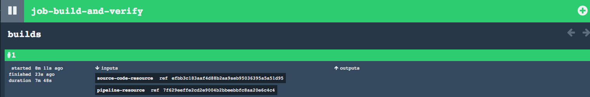

# Build and Verify

## Purpose
This is going to be our first pipeline which will compile an application and run Junit tests using Maven. Nothing more.  
The pipeline project is a template or a generic pipeline that we want to use to build any java application. It is important
that we distinguish between our application repository and the actual pipeline's repository. The pipeline repository, where
we are right now, consists of a set of artifacts (`pipeline.yml`, task ymls and bash scripts) that together knows how to
build java applications. The idea is that every java application does not need to do its job pipeline but instead leverage
an existing one.

The application repository that we are going to build as means to demonstrate this pipeline is https://github.com/MarcialRosales/maven-concourse-pipeline-app1.

## Pipeline explained
If we open the `pipeline.yml` we will see the following items:
- a **git resource** `source-code-resource` which is the source code of the application we want to build
- another **git resource** `pipeline-resource` which is the actual pipeline and all its jobs and tasks files
- a **job** `job-build-and-verify` which will check out the source code, the pipelines' files and it will invoke a task
called `build-and-verify`.

```
---
resources:
- name: source-code-resource
  type: git
  source:
    uri: {{source-code-resource-uri}}
- name: pipeline-resource
  type: git
  source:
    uri: {{pipeline-resource-uri}}
    branch: {{pipeline-resource-branch}}

jobs:
- name: job-build-and-verify
  plan:
  - get: source-code-resource
    trigger: true
  - get: pipeline-resource
  - task: build-and-verify
    file: pipeline-resource/tasks/maven-build.yml
    input_mapping: {source-code: source-code-resource, pipeline: pipeline-resource}
```

We want to use this same pipeline to build any application, therefore we have to externalize the application's repository
 and pipeline repository, although this last one is not absolutely necessary. If you look at the pipeline above, you will see 3 variables : `{{source-code-resource-uri}}`, `{{pipeline-resource-uri}}` and `{{pipeline-resource-branch}}`. The latter variable
 allows us to configure which branch of the pipeline repository we want to use.

Every application we are going to build must have a `credentials.yml` file where we resolve those variables. In the case of our [app1](https://github.com/MarcialRosales/maven-concourse-pipeline-app1) we will have a [credentials.yml](https://github.com/MarcialRosales/maven-concourse-pipeline-app1/credentials.yml) that looks like this:

```
source-code-resource-uri: https://github.com/MarcialRosales/maven-concourse-pipeline-app1
pipeline-resource-uri: https://github.com/MarcialRosales/maven-concourse-pipeline
pipeline-resource-branch: 01_build_and_verify
```

## Run the pipeline!
We are ready to launch our first pipeline in Concourse. If you have not logged in yet with *Concourse* thru *fly* it is time to do it. If you don't know how, check it out [here](https://github.com/MarcialRosales/maven-concourse-pipeline#00---set-up-concourse).

To set up a pipeline we are going to invoke the following command from our application's folder (i.e. `maven-concourse-pipeline-app1`):
```
$maven-concourse-pipeline-app1$ curl https://raw.githubusercontent.com/MarcialRosales/maven-concourse-pipeline/01_build_and_verify/pipeline.yml --output pipeline.yml
maven-concourse-pipeline-app1$ fly -t plan1 sp -p build-and-verify -c pipeline.yml -l credentials.yml
```
- first we downloaded the `pipeline.yml` file we want to use. We don't need the checkout the entire pipeline project, just the `pipeline.yml` file.
- `fly -t plan1` is saying we want to target the *Concourse* instance we logged in earlier
- `sp` means `set-pipeline`, it is the actual command
- `p build-and-verify` is the name we want to give it to our pipeline.
- `-c pipeline.yml` is the actual pipeline definition. We don't want to commit this file in our project so it is the `.gitignore` file. Rmemeber, this file is in the pipeline repository. `credentials.yml` file.
- `-l credentails.yml` this is the file that customizes the pipeline for our application. We want to commit this file in our project unless it has sensitive data like usernames or passwords, which is not the case, at least fow now.

When we run that command  `fly -t plan1 sp ...`, *fly* will print out the final pipeline that it will be pushed to *Concourse*. See how it has resolved the variables with the actual values in our `credentials.yml` file.

```
resources:
  resource source-code-resource has been added:
    name: source-code-resource
    type: git
    source:
      uri: https://github.com/MarcialRosales/maven-concourse-pipeline-app1

  resource pipeline-resource has been added:
    name: pipeline-resource
    type: git
    source:
      branch: 01_build_and_verify
      uri: https://github.com/MarcialRosales/maven-concourse-pipeline

jobs:
  job job-build-and-verify has been added:
    name: job-build-and-verify
    plan:
    - get: source-code-resource
      trigger: true
    - get: pipeline-resource
    - task: build-and-verify
      file: pipeline-resource/tasks/maven-build.yml
      input_mapping:
        pipeline: pipeline-resource
        source-code: source-code-resource
```

If we go to *Concourse* UI we will see our pipeline like this:


The pipelines can be in 2 states: They can be paused, i.e they will not ever run no matter what or they can be active, i.e. they can trigger or be manually executed. By default, when we set a pipeline, it will be paused. Run the following command to activate it:
`fly -t plan1 unpause-pipeline -p build-and-verify`.

As soon as we unpause it, *Concourse* will start the pipeline. We can track our pipeline via *fly* too:
```
$fly -t plan1 builds
id  pipeline/job                           build  status   start                     end  duration
1   build-and-verify/job-build-and-verify  1      started  2017-01-11@19:57:49+0100  n/a  2m0s+
```
And we can check out what is going on with the build by invoking this other command:
```
$ fly -t plan1 watch -j build-and-verify/job-build-and-verify
```
This is very useful because sometimes the build may take a long time to start for various reason. One reason is when *Concourse* has to pull lots of Docker images. 

Eventually, *Concourse* downloads all the required docker images and invokes our `maven-build.yml` task. This task will take a long time to run because we will see that Maven is downloading all the dependencies from central repo over the internet.

And finally, *Concourse* successfully builds our application.



The screenshot tells us in a very concise manner all we need to know about our pipeline:
- the build job number **1** was successful (because its green background color)
- when it started and finished and the duration
- the input resources and their versions. We required 2 git resources, the actual app and the pipeline.
- and it did not produce any output.
