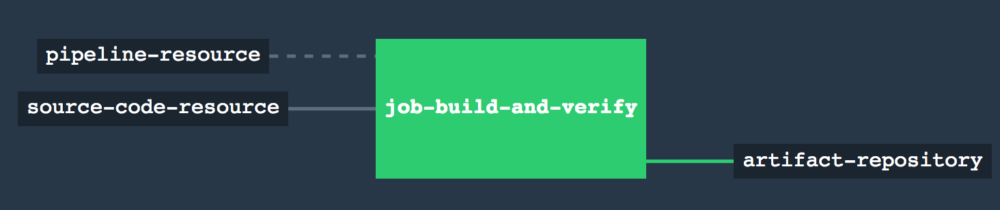
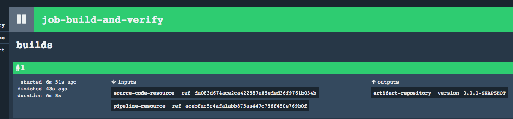

# Deploy Artifact to Pivotal Cloud Foundry

## Purpose

The purpose of this step is to take an artifact from a Maven repository *JFrog* and push it *Cloud Foundry*. This step should trigger as soon as a new version is available.

## Set up
We inherit the set up from the step `02_use_corporate_maven_repo` which gives us *Concourse* and *JFrog*.

If we haven't launch our infrastucture yet, we can do it now:
`nohup docker-compose up & `

However, we need an account in *Cloud Foundry* where to push our application. For this demonstration project, we are going to use *Pivotal Web Service*.

## Pipeline explained

We are going to introduce a new *Concourse* resource called [cf-resource](https://github.com/concourse/cf-resource) to publish our application's artifact (jar) to *Cloud Foundry*.

### Declare deploy-to-cf as a cf-resource
We don't need to declare `cf-resource` as a `resource-type` because it is one of the resource-types that *Concourse* recognizes out of the box. But we still need to declare a resource and configure it with our *Cloud Foundry* account details.

```
- name: deploy-to-cf
  type: cf-resource
  source:
    api: {{cf-api}}}
    username: {{cf-username}}
    password: {{cf-password}}
    organization: {{cf-org}}
    space: {{cf-space}}
    skip_cert_check: false

```

These are the actual values of those variables in the `credentials.yml`:
```
cf-api: https://api.run.pivotal.io
cf-username: <your username>
cf-password: <your pass>
cf-organization: <your org>
cf-space: <your space>

```

### Copy Maven's produced jar to an output folder
The other change we have to do is to put the built jar onto an `output` folder. For that we are going to modify the task definition file `maven-build.yml` to add these 2 lines. When we add these 2 lines, *Concourse* will create a folder called `build` in the root filesystem of the container where our task runs.

```
outputs:
  - name: build
```

And we add the following lines to the `maven-build.sh` so that it copies the jar into that folder.
```

echo "Publishing artifact from target to <output folder: ../build>"
cp target/*.jar ../build
```

### Push produced jar to Maven local repo
And the last change is to modify the job in the `pipeline.yml` so that we publish to artifactory the jar we copied to the `build` folder.
You maybe be wondering why do we need `input_mapping` and `output_mapping` attributes in the `task: build-and-verify`. It is a way to create aliases. In the task `maven-build.sh` we declared an output folder with the name `build`. However, that `build` folder receives a different name on this `pipeline.yml` file, it is named `built-artifact`. It is the same folder but with has different names depending whether we are within the task or in the pipeline. It is not that important to fully understand why we need it at the moment.

There is a nasty bit on this pipeline which is how we tell the `artifactory-repository` resource which file to push to Maven repo. In *Concourse* we cannot concatenate multiple variables like this: `file: ./built-artifact/{{artifact-id}}-*`. If this expression would have been valid, it would resolve to `file: ./built-artifact/maven-concourse-pipeline-app1-*` however *Concourse* produces instead this which is wrong: `file: ./built-artifact/"maven-concourse-pipeline-app1"-*`. For this reason, I have to declare the file we want to publish in the `credentials.yml` file which is very nasty because we have to reference the folder `built-artifact` which is defined in the pipeline. It is a very ugly solution.

```
jobs:
- name: job-build-and-verify
  plan:
  - get: source-code-resource
    trigger: true
  - get: pipeline-resource
  - task: build-and-verify
    file: pipeline-resource/tasks/maven-build.yml
    input_mapping: {source-code: source-code-resource, pipeline: pipeline-resource}
    output_mapping: {build: built-artifact}
    params:
      M2_SETTINGS_REPO_ID: {{repo-id}}
      M2_SETTINGS_REPO_USERNAME: {{repo-username}}
      M2_SETTINGS_REPO_PASSWORD: {{repo-password}}
      M2_SETTINGS_REPO_RELEASE_URI: {{repo-release-uri}}
      M2_SETTINGS_REPO_SNAPSHOT_URI: {{repo-snapshot-uri}}
  - put: artifact-repository
    params:
      file: {{artifact-to-publish}}

```

## Let's run the pipeline

Once again, we are going to set the pipeline from our application's folder (i.e. `maven-concourse-pipeline-app1`).
```
maven-concourse-pipeline-app1$ curl https://raw.githubusercontent.com/MarcialRosales/maven-concourse-pipeline/03_deploy_artifact/pipeline.yml --output pipeline.yml
maven-concourse-pipeline-app1$ fly -t plan1 sp -p deploy-artifact -c pipeline.yml -l credentials.yml
```
This is our pipeline:


This is a successful job summary:



This time, the pipeline produced an output resource, `artifact-repository` is the name of the resource, and the version is `0.0.1-SNAPSHOT`. This output resource can easily be the input resource of another pipeline. That is why it is so important that the outcome of a pipeline, like a jar, be an output resource. If we would have used Maven's artifact distribution mechanism, the jar would have also been deployed to our local maven repo but *Concourse* would not know about it.
