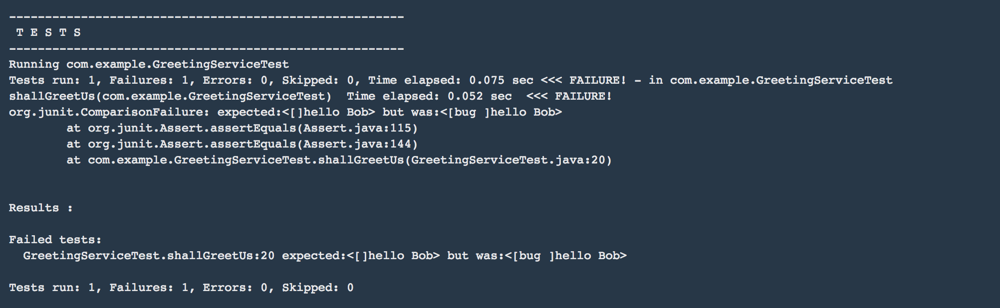

# Deploy Surefire Reports
=======

## Purpose
What about if we want to look at the surefire reports? Although we can look at what junit test cases failed via the logs produced by the *build-and-test* job, it would be great if we could look at them via the browser.

We are going to use *Maven Assembly plugin* to produce a `tgz` with all the surefire reports and publish it in *Artifactory*.

## Set up

1. Check out this branch
  `concourse-tutorial/maven-concourse-pipeline$ git checkout origin/30_deploy_poject_reports`
2. Update `concourse-tutorial/maven-concourse-pipeline-app1/credentials.yml` :
  ```
  pipeline-resource-branch: 30_deploy_poject_reports
  ```

## Configure Assembly plugin

We are going to modify the `pom.xml` to include the assembly plugin and add the `src/assembly/surefire.xml` file.

*pom.xml*
```
<build>
  <plugins>
     ...
     <plugin>
       <artifactId>maven-assembly-plugin</artifactId>
       <configuration>
       <descriptors>
           <descriptor>src/assembly/surefire.xml</descriptor>
       </descriptors>
       </configuration>
     </plugin>
  </plugins>
</reporting>
```

*surefire.xml*
```
<assembly xmlns="http://maven.apache.org/ASSEMBLY/2.0.0"
    xmlns:xsi="http://www.w3.org/2001/XMLSchema-instance"
    xsi:schemaLocation="http://maven.apache.org/ASSEMBLY/2.0.0 http://maven.apache.org/xsd/assembly-2.0.0.xsd">
  <id>surefire</id>
  <formats>
    <format>tgz</format>
  </formats>
  <includeBaseDirectory>false</includeBaseDirectory>
  <fileSets>
    <fileSet>
      <directory>target/surefire-reports</directory>
    </fileSet>
  </fileSets>

</assembly>
```

## Pipeline explained

The pipeline demonstrates how we can run unit tests and publish a tarball with the outcome of the tests cases to *Artifactory* regardless of the outcome. If there are test cases failures, the job **job-build-and-verify** will fail but we are still publishing the surefire reports but not the actual jar.

```
- task: build-and-verify
  file: pipeline-resource/tasks/maven-build.yml
  input_mapping: {source-code: source-code-resource, pipeline: pipeline-resource, version: version-resource}
  output_mapping: {build: built-artifact}
  params:
    BRANCH: {{source-code-resource-branch}}
    M2_SETTINGS_REPO_ID : {{repo-id}}
    M2_SETTINGS_REPO_USERNAME : {{repo-username}}
    M2_SETTINGS_REPO_PASSWORD : {{repo-password}}
    M2_SETTINGS_REPO_RELEASE_URI : {{repo-release-uri}}
    M2_SETTINGS_REPO_SNAPSHOT_URI : {{repo-snapshot-uri}}
  ensure:
    put: surefire-report-resource
    params:
      file: {{surefire-to-publish}}
- put: built-artifact-repository
  params:
    file: {{artifact-to-publish}}
```

`put: built-artifact-repository` is invoked provided the previous task `build-and-verify` is successful. If there are tests failures, `build-and-verify` is not successful. However, `ensure: put: surefire-report-resource` will be invoked regardless of the outcome of `build-and-verify`.

# Let's run the pipeline

From `maven-concourse-pipeline-app1` folder we run `concourse-tutorial/maven-concourse-pipeline-app1$ fly -t plan1 sp -p 30_deploy_poject_reports -c ../maven-concourse-pipeline/pipeline.yml -l credentials.yml -l secrets.yml
`


## how do we check the tests cases that failed?

We can either look at them thru the concourse logs.


Or we can download the reports from artifactory:
http://192.168.99.100:8081/artifactory/simple/libs-release-local/maven-concourse-pipeline-app1-0.0.1-SNAPSHOT-surefire.tgz
