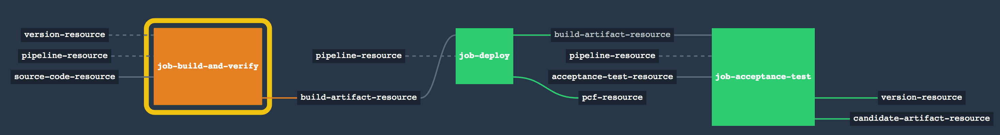
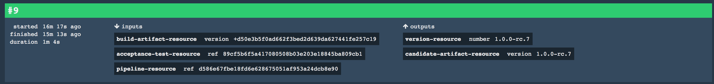

# Deploy, Verify and Promote Release candidate

## Purpose

The purpose of this step is to take the latest *built artifact* from a Maven repository *JFrog* and deploy it to *Cloud Foundry*, verify that it passes a set of acceptance tests and promote it as a release candidate to Maven.

## Set up
We inherit the set up from the step `02_use_corporate_maven_repo` which gives us *Concourse* and *JFrog*.

If we haven't launched our infrastucture yet, we can do it now:
`nohup docker-compose up & `

However, we need an account in *Cloud Foundry* where to push our application. For this demonstration project, we are going to use *Pivotal Web Service*. If you don't have a *PWS* account go to [https://run.pivotal.io/](https://run.pivotal.io/) and set up a free demo account. Once you have an account we will add the following credentials to our application's `credentials.yml` file.
```
# Deployment to Cloud Foundry
cf-api: https://api.run.pivotal.io
cf-username: ###  
cf-password: ###
cf-org: pivotal-emea-cso
cf-space: mrosales
```

## Pipeline explained

The pipeline will consists of 3 jobs. The one we have been using so far, `job-build-and-verify`, which builds and runs the unit tests and installs the built artifact in Maven. And two new jobs which depends on the success of the first one. The second job takes the built artifact from Maven and deploys to *Cloud Foundry*. And the third job runs the acceptance tests against the deployed artifact and promotes the built artifact to a release candidate and installs it in Maven if all tests pass. Promoting means eliminating the build number from the built artifact so that we are only left with the release candidate part and to bump the release candidate version for subsequent builds.

We are going to introduce a new *Concourse* resource called [cf-resource](https://github.com/concourse/cf-resource) to deploy our application's artifact (jar) to *Cloud Foundry*.

### Declare pcf-resource as a cf resource
We don't need to declare `cf` as a `resource-type` because it is one of the resource-types that *Concourse* recognizes out of the box. But we still need to declare a `cf` resource and configure it with our *Cloud Foundry* account details.

**Note: We are building the entire pipeline from dev to prod in a single pipeline file. This is not the only way of doing it. You can certainly have one pipeline for development and a separate one for production**

```
resources:
  ....
- name: pcf-resource
  type: cf
  source:
    api: {{cf-api}}
    username: {{cf-username}}
    password: {{cf-password}}
    organization: {{cf-org}}
    space: {{cf-space}}
    skip_cert_check: false
   ....
```

These are the actual values comes from the variables we defined earlier in the `credentials.yml`.

### Add a new job that deploys the built artifact to *Cloud Foundry* as soon as a new version is available

We need to add a new job different to the one we had before that we called `job-build-and-verify`. The purpose of that job was just to build an artifact and to push it to a maven repository if the unit tests passed. Once that artifact is ready in the maven repo, we can trigger other jobs like the one we are about to add. Our job, `job-deploy-to-pcf` will take the latest artifact from the maven repo and push it to the configured *Cloud Foundry* account whose details are in the `credentials.yml`.

```
    ....
jobs:
    ....

- name: job-deploy
  plan:
  - get: build-artifact-resource
    trigger: true
    passed: [job-build-and-verify]
  - get: pipeline-resource
  - task: generate-manifest
    file: pipeline-resource/tasks/generate-manifest.yml
    input_mapping: {pipeline: pipeline-resource, artifact: build-artifact-resource}
    params:
      APP_NAME: {{cf-app-name}}
      APP_HOST: {{cf-app-host}}
      APP_DOMAIN: {{cf-app-domain}}
  - put: pcf-resource
    params:
      manifest: manifest/manifest.yml
  ...

```

We have configured this job to trigger as soon as a new artifact becomes available (see the `trigger: true` attribute in the `- get: artifact-resource`). Before we can push the artifact (our jar) we need to generate a `manifest.yml` file and we have created a task for that called `generate-manifest`. And like with any other task, they reside in the pipeline repository, that is why we need `- get: pipeline-resource`.  The task produces a folder called `manifest` which has the `manifest.yml` file and the artifact itself. See the 3 parameters we are passing to the task: `APP_NAME`, `APP_HOST`, `APP_DOMAIN`. Our task uses these 3 parameters to produce the corresponding `manifest.yml`.

### Add a new job that runs the acceptance tests and installs a release candidate if they are successful

This job will trigger only when there is a new built artifact in Maven and the job `job-deploy` has successfully run too, in other words, we have something ready to test. We need to add new git resource for the acceptance tests. We have decided that acceptance tests are separate from the application's source code. If we were doing strictly BDD, we would start writing  an acceptance test which runs against our local server, probably running within our IDE. We can still do BDD at the unit level following the [Hexagonal architecture, a.k.a. Ports and Adapters](http://alistair.cockburn.us/Hexagonal+architecture) which is much cheaper and quicker. In this project, acceptance tests means "end to end" testing which is against the **Real Thingy**, with all its dependencies, such as databases, messaging middleware, calls to downstream services, etc.

Conclusion, *acceptance test* -at least on this project- means *test this feature in a production-like environment*. And to write our acceptance tests we have chosen [Cucumber](https://cucumber.io/) and to make rest calls we are not using this time Spring, instead we are using [Rest Assured](http://rest-assured.io/).

Note: The acceptance test's project lives in the same repo as the application's source code but on a different branch, `acceptance-test`, just for simplicity. But we could have dedicated a repository for the acceptance tests alone.

```
  ....
jobs:

- name: job-acceptance-test
  plan:
  - get: build-artifact-resource
    trigger: true
    passed: [job-deploy]
  - get: acceptance-test-resource
    trigger: true
  - get: pipeline-resource
  - task: run-acceptance-test
    file: pipeline-resource/tasks/maven-test.yml
    input_mapping: {acceptance-test: acceptance-test-resource, pipeline: pipeline-resource}
    params:
      APP_DOMAIN: {{cf-app-domain}}
      APP_HOST: {{cf-app-host}}
      M2_SETTINGS_REPO_ID: {{repo-id}}
      M2_SETTINGS_REPO_USERNAME: {{repo-username}}
      M2_SETTINGS_REPO_PASSWORD: {{repo-password}}
      M2_SETTINGS_REPO_RELEASE_URI: {{repo-release-uri}}
      M2_SETTINGS_REPO_SNAPSHOT_URI: {{repo-snapshot-uri}}
  - put: version-resource
    params: { pre: rc }

  ....

```

We have implemented a brand new task, defined in `maven-test.yml`, which simply calls `mvn test` and it executes *Cucumber* fixtures thru Maven. Because we are invoking Maven, we need all the standard Maven Repo settings, in addition to 2 new parameters: `APP_DOMAIN` and `APP_HOST` which we use the build the base uri of the application running in *Cloud Foundry*. I am sure there are smarter ways of doing it but this is simply just to get going.

If the `run-acceptance-test` task is successful that means that all tests passed and we can promote the built artifact to a release candidate. Remember that we had deployed a built artifact. That is why we do
```
   - put: version-resource
     params: { pre: rc }
```
 which is saying, bump up the rc part of the version and commit it back to git.

 And finally, we need to install our release candidate to Maven.


## Let's run the pipeline

Once again, we are going to set the pipeline from our application's folder (i.e. `maven-concourse-pipeline-app1`).



```
maven-concourse-pipeline-app1$ curl https://raw.githubusercontent.com/MarcialRosales/maven-concourse-pipeline/20_deploy_and_verify/pipeline.yml --output pipeline.yml
maven-concourse-pipeline-app1$ fly -t plan1 sp -p 20_deploy_and_verify -c pipeline.yml -l credentials.yml
```


